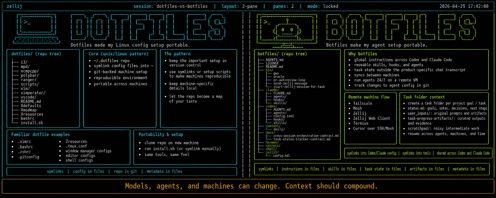
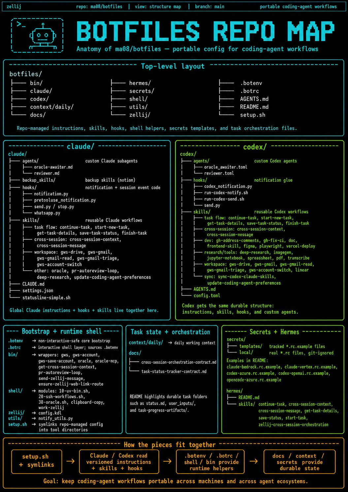
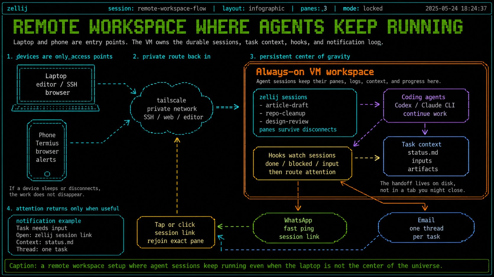
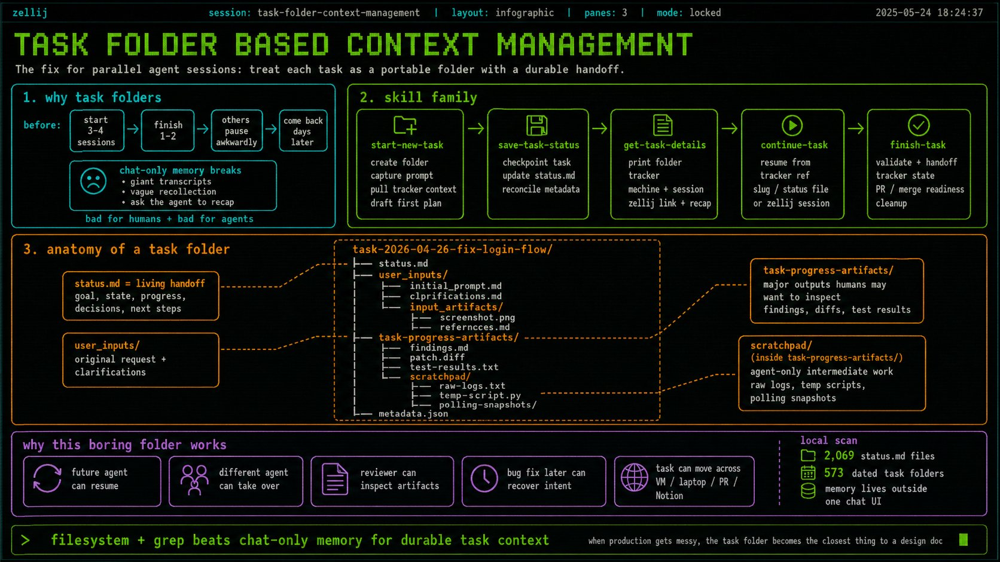
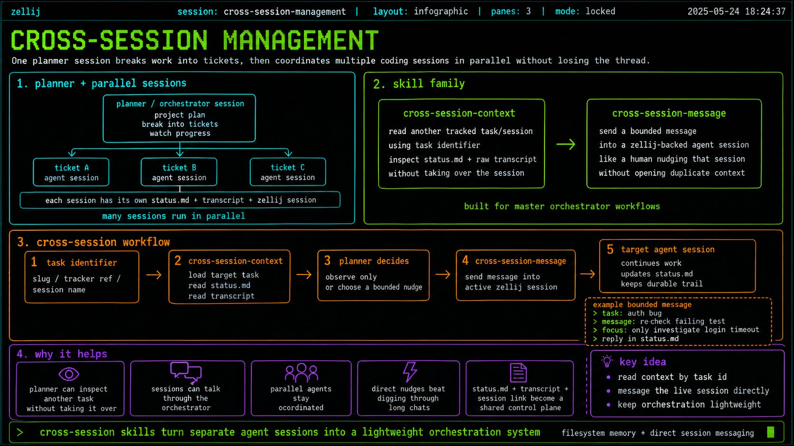
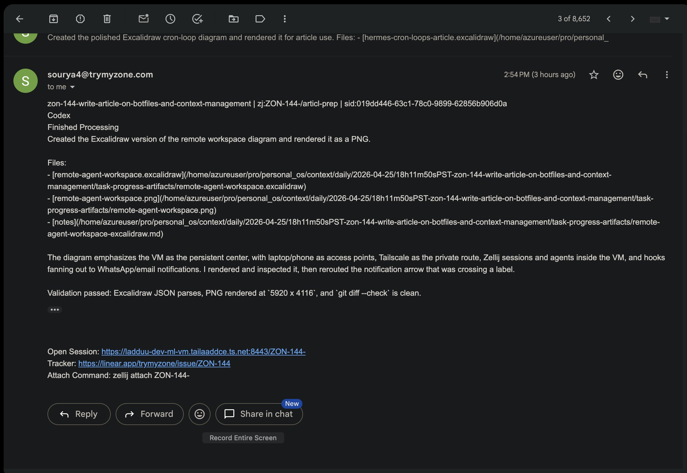
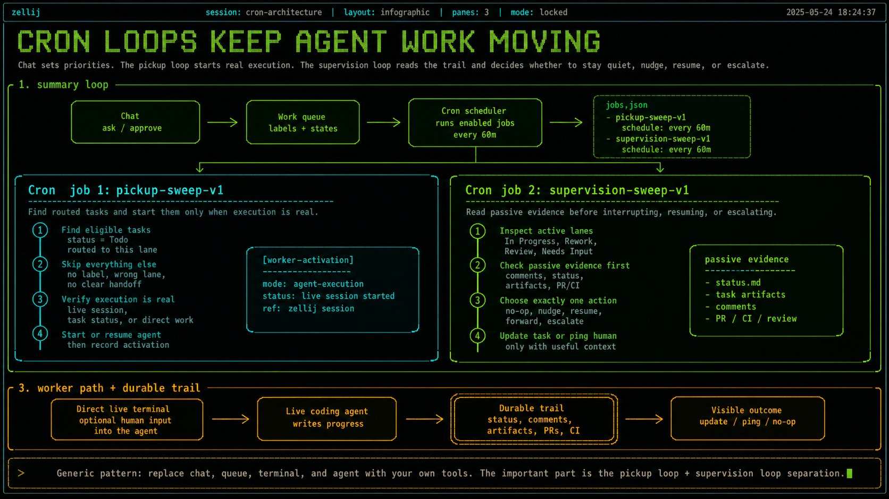

# Botfiles

Opinionated configuration files for coding-agent workflows, designed to stay portable across machines and agent ecosystems.

This is my personal "botfiles" repo: a play on Unix-style dotfiles, but focused on agent behavior rather than only shell/editor setup. It keeps Codex, Claude Code, hooks, skills, task-status conventions, zellij helpers, and notification wiring aligned across the machines where I run long-lived coding agents.

Read the companion X Article: [Botfiles: A Dotfiles-Inspired Model-Agnostic Setup for 24/7 Agents](https://x.com/curious_queue/status/2049660997993152855).

[](https://x.com/curious_queue/status/2049660997993152855)

## Visual Map

Use this as a faster path through the long README. Each image jumps to the section it explains.

<table>
  <tr>
    <td align="center">
      <a href="#whats-included"></a><br>
      <strong><a href="#whats-included">Repo map</a></strong><br>
      <sub>What lives in botfiles and why.</sub>
    </td>
  </tr>
  <tr>
    <td align="center">
      <a href="#ssh-workflow-commands"></a><br>
      <strong><a href="#ssh-workflow-commands">Remote stack</a></strong><br>
      <sub>SSH, mosh, zellij, and remote agent sessions.</sub>
    </td>
  </tr>
  <tr>
    <td align="center">
      <a href="#tracked-task-lifecycle-skills"></a><br>
      <strong><a href="#tracked-task-lifecycle-skills">Task lifecycle</a></strong><br>
      <sub>How sessions start, save state, resume, and finish.</sub>
    </td>
  </tr>
  <tr>
    <td align="center">
      <a href="#cross-session-orchestration"></a><br>
      <strong><a href="#cross-session-orchestration">Cross-session work</a></strong><br>
      <sub>Inspect and message live agent sessions without remote control.</sub>
    </td>
  </tr>
  <tr>
    <td align="center">
      <a href="#zellij-web-links-in-notifications"></a><br>
      <strong><a href="#zellij-web-links-in-notifications">Notifications</a></strong><br>
      <sub>Task context, tracker IDs, and zellij links in alerts.</sub>
    </td>
  </tr>
  <tr>
    <td align="center">
      <a href="#whats-included"></a><br>
      <strong><a href="#whats-included">Hermes experiments</a></strong><br>
      <sub>Pickup and supervise loops for agent-team UX.</sub>
    </td>
  </tr>
</table>

## Start Here

This repo is public as a reference implementation, not a turnkey product. It reflects my own machines, tools, task folders, and workflow preferences, so the useful move is to copy patterns rather than clone the whole setup unchanged.

### Who This Is For

- Solo builders using Codex, Claude Code, or other CLI coding agents.
- People who want agent context to survive across models, machines, and sessions.
- Teams exploring long-running remote agent workspaces.
- Anyone who wants examples of task folders, skills, hooks, zellij workflows, and notification loops.

### Copy These Ideas First

1. **Durable task folders**: keep `status.md`, `user_inputs/`, and `task-progress-artifacts/` outside any single chat transcript.
2. **Shared agent instructions**: store global preferences in versioned files such as `codex/AGENTS.md` and `claude/CLAUDE.md`.
3. **Reusable skills**: keep repeatable workflows as file-backed skills that can be mirrored across agents.
4. **Resume-friendly sessions**: use zellij plus task metadata so interrupted work can be found, inspected, and continued.
5. **Notification hooks**: send compact task context and session links to the places where you actually notice them.

### Ignore These At First

- My exact machine names, SSH aliases, tailnet hostnames, and model/provider profiles.
- Any local secret values or private workflow assumptions.
- The full setup script if all you want is one pattern. Start with a single idea, adapt it, and expand only when it earns its keep.

## What's Included

- **settings.json** - Claude Code settings (hooks, plugins, model preferences)
- **statusline-simple.sh** - Custom statusline script
- **hooks/** - Notification hooks for local and WhatsApp alerts
  - Sends notifications when Claude finishes responding
  - Sends notifications when Claude needs permission
  - Sends notifications when Claude asks a question
- **skills/** - Claude Code skills for extended capabilities
- **claude/agents/** - Source-controlled custom Claude Code subagents, synced into `~/.claude/agents` (`oracle-awaiter`, `reviewer`)
- **codex/agents/** - Source-controlled custom Codex agents, synced into `~/.codex/agents` (`oracle_awaiter`, `reviewer`)
- **codex/** - Codex CLI config, synced skills, and global AGENTS instructions
- **secrets/** - Centralized secret templates and local runtime secret files
- **.botenv** — Non-interactive-safe core bootstrap (secrets, PATH, EDITOR, TERM, UV_BIN)
- **.botrc** - Interactive shell layer (aliases, functions) that sources `.botenv`
- **bin/** - Repo-managed command wrappers for Oracle, Google Workspace, zellij session launch, and cross-session helpers
- **shell/** - Reusable shell modules loaded by `.botrc` (for example SSH workflow helpers)
- **zellij/** - Canonical Zellij config (including remaps away from `Ctrl+g` and `Ctrl+t`)
- **docs/** - Shared contracts for task-status metadata and cross-session orchestration
- **context/** - A few committed examples of task records and artifacts produced by task-related skills
- **hermes/** - Early shared workflow assets for Hermes-style agents

## Prerequisites

- [Claude Code CLI](https://claude.ai/claude-code) installed
- [uv](https://github.com/astral-sh/uv) - Python package manager
- [terminal-notifier](https://github.com/julienXX/terminal-notifier) - macOS notifications (optional)
- [fzf](https://github.com/junegunn/fzf) - interactive session picker for `work-*` SSH workflows (optional but recommended)
- [mosh](https://mosh.org/) - mobile shell transport for mosh-first workflows (optional; SSH fallback remains available)
- [Poppler](https://poppler.freedesktop.org/) - PDF CLI tools such as `pdfinfo`, `pdftoppm`, and `pdftotext` used by PDF workflows (recommended)

```bash
# Install uv
curl -LsSf https://astral.sh/uv/install.sh | sh

# Install terminal-notifier (macOS)
brew install terminal-notifier

# Install optional SSH workflow tools (macOS)
brew install fzf mosh

# Install PDF workflow tools (macOS)
brew install poppler
```

Ubuntu/Debian PDF workflow install:

```bash
sudo apt-get install -y poppler-utils
```

Keep the curated upstream `codex/skills/pdf` skill unmodified so future upstream pulls stay simple. Install Poppler at the machine level, and for one-off Python PDF work prefer `uv run --with reportlab,pdfplumber,pypdf ...` from a task scratchpad instead of mutating arbitrary project environments.

## Quick Setup

1. **Clone the repository**
   ```bash
   git clone <repo-url> ~/pro/botfiles
   cd ~/pro/botfiles
   ```

2. **Run the setup script**
   ```bash
   ./setup.sh
   ```
   The script now also performs warn-only checks for SSH workflow dependencies (`ssh`, `fzf`, `mosh`), `~/.ssh/config`, and machine-appropriate PDF tooling hints.

3. **Create local secret files from templates**
   ```bash
   mkdir -p secrets/local
   cp secrets/templates/claude-bedrock.rc.example secrets/local/claude-bedrock.rc
   cp secrets/templates/codex-azure.rc.example secrets/local/codex-azure.rc
   cp secrets/templates/machine.rc.example secrets/local/machine.rc
   cp secrets/templates/claude-hooks.rc.example secrets/local/claude-hooks.rc
   # Optional:
   cp secrets/templates/linear.rc.example secrets/local/linear.rc
   cp secrets/templates/claude-vertex.rc.example secrets/local/claude-vertex.rc
   cp secrets/templates/codex-openai.rc.example secrets/local/codex-openai.rc
   cp secrets/templates/opencode-azure.rc.example secrets/local/opencode-azure.rc
   # Edit secrets/local/*.rc with your values
   ```

4. **Load shared env config** (setup.sh does this automatically)
   ```bash
   # For zsh (macOS):
   echo '[ -f "$HOME/pro/botfiles/.botenv" ] && . "$HOME/pro/botfiles/.botenv"' >> ~/.zshenv
   echo 'source ~/pro/botfiles/.botrc' >> ~/.zshrc

   # For bash (Linux) — append to whichever login file bash reads first
   # (~/.bash_profile > ~/.bash_login > ~/.profile; usually ~/.profile on Ubuntu)
   echo 'export BASH_ENV="$HOME/pro/botfiles/.botenv"' >> ~/.profile  # or ~/.bash_profile
   echo 'source ~/pro/botfiles/.botrc' >> ~/.bashrc
   ```

5. **Restart Claude Code**

## Manual Setup

If you prefer manual setup:

```bash
# Create symlinks
ln -sf ~/pro/botfiles/claude/settings.json ~/.claude/settings.json
ln -sf ~/pro/botfiles/claude/statusline-simple.sh ~/.claude/statusline-simple.sh
ln -sf ~/pro/botfiles/claude/hooks ~/.claude/hooks
ln -sf ~/pro/botfiles/claude/skills ~/.claude/skills
ln -sf ~/pro/botfiles/claude/agents ~/.claude/agents
ln -sf ~/pro/botfiles/codex/config.toml ~/.codex/config.toml
ln -sf ~/pro/botfiles/codex/agents ~/.codex/agents
ln -sf ~/pro/botfiles/codex/skills ~/.codex/skills
ln -sf ~/pro/botfiles/codex/AGENTS.md ~/.codex/AGENTS.md
mkdir -p ~/.config/zellij
ln -sf ~/pro/botfiles/zellij/config.kdl ~/.config/zellij/config.kdl

# Install Python dependencies
cd ~/pro/botfiles/claude/hooks
uv sync
```

Then wire the two-layer bootstrap into your shell entrypoints (see [Shell Environment](#shell-environment-two-layer-bootstrap) below).

## Configuration

### Shell Environment (two-layer bootstrap)

Botfiles uses a two-layer shell environment model:

**`.botenv` (core, non-interactive safe)**
- Secrets from `secrets/local/*.rc`
- PATH additions (`$BOTFILES_ROOT/bin`, `~/.local/bin`, `/usr/local/bin`)
- Core env: `BOTFILES_ROOT`, `EDITOR`, `VISUAL`, `TERM`, `UV_BIN`
- Safe to source from any context: SSH commands, cron, systemd, agent exec
- Exposes repo-managed executables like `oracle` and `oracle-mcp` to non-interactive shells

**`.botrc` (interactive layer)**
- Sources `.botenv` first (idempotent via double-source guard)
- Adds aliases (`cc`, `bedcc`, `zj`, etc.)
- Loads interactive shell modules (`20-ssh-workflows.sh`, `30-oracle.sh`)
- Defines workflow functions (`work-ml`, `oracle`, etc.) on top of the shared executable wrappers

**Shell entrypoint wiring:**

For **zsh** (macOS):
```bash
# ~/.zshenv (ALL zsh contexts, including non-interactive)
[ -f "$HOME/pro/botfiles/.botenv" ] && . "$HOME/pro/botfiles/.botenv"

# ~/.zshrc (interactive only)
source ~/pro/botfiles/.botrc
```

For **bash** (Linux):
```bash
# Effective login file (login shells — sets BASH_ENV for non-interactive children).
# Bash reads the first of ~/.bash_profile, ~/.bash_login, ~/.profile.
# Add this to whichever one your system uses (usually ~/.profile on Ubuntu).
export BASH_ENV="$HOME/pro/botfiles/.botenv"

# ~/.bashrc (interactive shells)
source ~/pro/botfiles/.botrc
```

`setup.sh` configures these entrypoints automatically and symlinks `oracle` / `oracle-mcp` into `~/.local/bin` so command runners like `watch` can resolve them without sourcing `.botrc`.

`setup.sh` also symlinks `~/.claude/agents` to `claude/agents`, `~/.codex/AGENTS.md` to `codex/AGENTS.md`, and `~/.codex/agents` to `codex/agents`.

Codex notify flow:
- `codex/config.toml` only calls `codex/hooks/run-codex-notify.sh`.
- `shell/10-uv-bin.sh` resolves `UV_BIN` once for Linux/macOS portability.

### Centralized Secrets

All runtime secrets live in `secrets/local/*.rc` (git-ignored).
All shareable templates live in `secrets/templates/*.rc.example` (tracked).

Start from templates:

```bash
mkdir -p ~/pro/botfiles/secrets/local
cp ~/pro/botfiles/secrets/templates/claude-bedrock.rc.example ~/pro/botfiles/secrets/local/claude-bedrock.rc
cp ~/pro/botfiles/secrets/templates/claude-vertex.rc.example ~/pro/botfiles/secrets/local/claude-vertex.rc
cp ~/pro/botfiles/secrets/templates/codex-azure.rc.example ~/pro/botfiles/secrets/local/codex-azure.rc
cp ~/pro/botfiles/secrets/templates/codex-openai.rc.example ~/pro/botfiles/secrets/local/codex-openai.rc
cp ~/pro/botfiles/secrets/templates/opencode-azure.rc.example ~/pro/botfiles/secrets/local/opencode-azure.rc
cp ~/pro/botfiles/secrets/templates/machine.rc.example ~/pro/botfiles/secrets/local/machine.rc
cp ~/pro/botfiles/secrets/templates/linear.rc.example ~/pro/botfiles/secrets/local/linear.rc
cp ~/pro/botfiles/secrets/templates/claude-hooks.rc.example ~/pro/botfiles/secrets/local/claude-hooks.rc
```

Then fill in values in each `secrets/local/*.rc` file.

`secrets/local/linear.rc` is the default place for `LINEAR_API_KEY` so shells, hooks, and tracker tooling inherit it through `.botenv` without scraping another repo's `.env`.

### Zellij Configuration

`setup.sh` symlinks `~/.config/zellij/config.kdl` to `zellij/config.kdl` in this repo.

Keybinding decision:
- Zellij lock mode is mapped to `Alt+g` (not `Ctrl+g`) to avoid conflicts with terminal apps such as Codex/Vim input workflows.
- Zellij tab mode is mapped to `Alt+t` (not `Ctrl+t`) so Codex keeps `Ctrl+t` available for its transcript overlay inside Zellij panes.

Clipboard copy behavior:
- `zellij/config.kdl` uses `copy_command "sh -c ~/pro/botfiles/shell/clipboard-copy"`.
- `shell/clipboard-copy` prefers remote Mac clipboard forwarding (`BOT_CLIPBOARD_SSH_TARGET`, default `sourya-mac`) and falls back to local clipboard tools (`pbcopy`, `wl-copy`, `xclip`, `xsel`).

### SSH Workflow Commands

The `shell/20-ssh-workflows.sh` module provides reconnect-friendly helpers for zellij workflows:

```bash
work-here          # manage zellij sessions on the current machine
work-ml            # mosh-first connect to ML VM, pick/create zellij session
work-ml-ssh        # SSH-only fallback path for ML VM
work-arya          # SSH-first connect to Aryabhatta, pick/create zellij session
work-arya-mosh     # mosh-first path for Aryabhatta (use when UDP is available)
work-arya-ssh      # explicit SSH path for Aryabhatta
work-agent         # SSH-first connect to agent-prod; prefer Tailscale alias, then public alias
work-agent-mosh    # mosh-first path for agent-prod with the same alias fallback
work-agent-ssh     # explicit SSH path for agent-prod with the same alias fallback
mml                # raw shell shortcut (mosh-first, no zellij attach)
marya              # raw shell shortcut (mosh-first, no zellij attach)
magent             # raw shell shortcut for agent-prod (mosh-first, no zellij attach; Tailscale then public alias)
cursor-ml          # open/reuse Cursor window at ML VM home over Remote-SSH
```

Dependency behavior:
- `fzf` is required for interactive picker mode.
- If `fzf` is missing, pass a session name explicitly (example: `work-ml my-session` or `work-here my-session`).
- Local `zellij` is required for `work-here`; remote hosts still need `zellij` for all `work-*` attach/create flows.
- `mosh` is only required for mosh-first commands (`work-ml`, `work-arya-mosh`, `work-agent-mosh`) and raw shell shortcuts (`mml`, `marya`, `magent`).
- If `mosh` is missing or transport fails, mosh-based workflows fall back to SSH on the selected host alias.
- Host selection can include both primary and fallback aliases when configured. ML always probes both. Agent-prod defaults to `ladduu-agent-prod` first and `ladduu-agent-prod-public` second only when you keep the built-in primary alias; if you override just `BOT_AGENT_HOST` or `BOT_AGENT_HOST_PRIMARY`, the fallback stays empty unless you set `BOT_AGENT_HOST_FALLBACK` explicitly.
- Cursor Remote-SSH uses SSH transport and cannot run directly over mosh transport.
- Use `cursor-ml` for editor workflow, `mml` for the ML raw terminal workflow, and `magent` for the agent-prod raw terminal workflow.

Interactive picker behavior:
- Current and active sessions are listed first with inline zellij metadata; `EXITED` sessions are grouped below them.
- `Enter` attaches the selected session or creates the highlighted `Create new session: <name>` row.
- `Ctrl-K` permanently deletes an `EXITED` session after a `y/N` confirmation.
- `Ctrl-R` refreshes the session list without leaving the workflow.
- When the typed query is a valid new session name, a dynamic create row appears at the top of the picker.
- After create, resurrect, delete, cancel, or failure actions, the helper prints a one-line record back to the shell when control returns.
- `work-here` is a plain-shell entrypoint. If you are already inside zellij on the current host, use `Ctrl-o w` to open the built-in session manager instead.
- The picker owns a zellij-inspired color theme: green session names, magenta age text, red `EXITED` state text, and muted `fzf` chrome for the prompt, border, and header.
- The current interaction model and themed output here are the functional baseline to preserve before any later visual refinements.

### Detached Task Session Launcher

Use `start-zellij-session-for-task` when you want to kick off a second Codex run
inside a detached zellij session without stealing the current terminal:

```bash
start-zellij-session-for-task "https://linear.app/trymyzone/issue/ZON-39/define-append-only-pr-review-comment-contract-keyed-by-head-sha"
start-zellij-session-for-task ZON-39
start-zellij-session-for-task --target ml "Investigate flaky Linear live-session sync"
```

Behavior:
- Resolves tracker-aware slugs with the same shared task-status tooling used by `start-new-task`.
- Creates a detached zellij session whose name matches the resolved task slug.
- Renames the initial tab to `[TRACKER-ID]` when a tracker is present.
- Launches Codex as the session's default shell so attaching lands on the live Codex UI.
- If the detached session comes up but the pane does not visibly show Codex/start-new-task output within a short verification window, the helper fails instead of treating session creation alone as success.
- Uses the current machine's default Codex profile instead of forcing a profile override.
- Clears inherited `CODEX_*` session metadata before starting the child Codex process.
- Seeds the child interactive Codex session with the exact initial `$start-new-task <original input>` prompt.
- That seeded `start-new-task` flow is expected to continue through initial tracker/local context review and first-pass plan approval in the child session when enough information is already available.
- Uses `codex --dangerously-bypass-approvals-and-sandbox`, the current CLI equivalent of the older `--yolo` shorthand.
- Prints the attach hint (`zellij attach ...`, `work-ml ...`, `work-arya ...`, or `work-agent ...`) plus the seeded initial prompt after launch.
- Supports `--dry-run` for inspection without starting the session.
- For remote targets, fails early if the resolved project root is not checked out on that host instead of launching an immediately exited session.

### Cross-Session Orchestration

Use these repo-managed helpers for regular non-Symphony multi-session work:

```bash
get-cross-session-context --project-root "$PWD" ZON-71 --include-transcript-tail 3
send-zellij-message --project-root "$PWD" --text "Please post a short status update." ZON-71
send-zellij-message --project-root "$PWD" --text "Please post a short status update." --execute --submit enter ZON-71
pr-autoreview-loop status --repo ~/pro/botfiles --pr 123
pr-autoreview-loop wait --repo ~/pro/botfiles --pr 123
```

Behavior:
- `get-cross-session-context` resolves another tracked task/session by tracker ref, task slug, or explicit task/session override.
- Task/status metadata is the primary contract; transcript tail is the targeted fallback; live zellij inspection is diagnostic only.
- `send-zellij-message` is dry-run by default and requires `--execute` for actual writes.
- `send-zellij-message` automatically adds a delayed confirm Enter for large multiline Codex payloads because one immediate Enter can leave the text staged instead of submitted.
- `send-zellij-message` refuses ambiguous multi-tab targets and cross-machine targets unless you intentionally use an explicit local `--zellij-session` override for debug work.
- `pr-autoreview-loop` matches only current-head reviewer artifacts, preferring `review-run-meta` top-level comments and falling back to exact-head GitHub review objects.
- `pr-autoreview-loop` is designed to support a semi-autonomous fix loop: wait for review, address findings, push, wait again, and stop only when clean or genuinely blocked.
- `pr-autoreview-loop` reports `blocked` instead of waiting forever when a repo has no detectable reviewer infrastructure and no valid current-head reviewer artifact exists yet.

See `docs/cross-session-orchestration-contract.md` for the shared v1 contract.

Optional environment variables (set before sourcing `.botrc`) let you override host aliases:

```bash
export BOT_ML_HOST_PRIMARY=ladduu-dev-ml-vm-ts
export BOT_ML_HOST_FALLBACK=ladduu-dev-ml-vm
export BOT_ARYA_HOST=ladduu-dev-aryabhatta
export BOT_AGENT_HOST=ladduu-agent-prod
export BOT_AGENT_HOST_PRIMARY=ladduu-agent-prod
export BOT_AGENT_HOST_FALLBACK=ladduu-agent-prod-public
export BOT_CURSOR_ML_HOST_PRIMARY=ladduu-dev-ml-vm-ts
export BOT_CURSOR_ML_HOST_FALLBACK=ladduu-dev-ml-vm
export BOT_CURSOR_ML_PATH=/home/azureuser
```

### WhatsApp Notifications

To enable WhatsApp notifications, create `secrets/local/claude-hooks.rc` with:

```bash
export WHATSAPP_ENABLED=true
export WHATSAPP_TOKEN="your_whatsapp_cloud_api_token"
export PHONE_NUMBER_ID="your_phone_number_id"
export NOTIFY_PHONE_NUMBER="+1234567890"
```

You'll need a [Meta WhatsApp Business API](https://developers.facebook.com/docs/whatsapp/cloud-api) account.

### Zellij Web Links in Notifications

You can include clickable session links (`Open Session: ...`) in WhatsApp and email alerts.

1. Ensure zellij web server is running locally on the machine:
   ```bash
   /opt/homebrew/bin/zellij web --status || /opt/homebrew/bin/zellij web --start --daemonize
   ```
   Linux path variant:
   ```bash
   zellij web --status || zellij web --start --daemonize
   ```

2. Expose zellij web over your tailnet on `:8443`:
   ```bash
   tailscale serve --bg --https=8443 127.0.0.1:8082
   tailscale serve status
   ```
   macOS app bundle CLI variant:
   ```bash
   /Applications/Tailscale.app/Contents/MacOS/Tailscale serve --bg --https=8443 127.0.0.1:8082
   /Applications/Tailscale.app/Contents/MacOS/Tailscale serve status
   ```

3. Add these to `secrets/local/claude-hooks.rc`:
   ```bash
   ZELLIJ_WEB_ENABLE_LINKS=true
   ZELLIJ_WEB_BASE_URL=https://<your-tailnet-dns-name>:8443
   ZELLIJ_SEND_ATTACH_COMMAND=true
   ```

4. Create a one-time zellij web login token:
   ```bash
   /opt/homebrew/bin/zellij web --create-token
   ```
   Save the resulting token securely and open:
   ```text
   https://<your-tailnet-dns-name>:8443/?token=<token>
   ```

5. Trigger a smoke notification:
   ```bash
   /opt/homebrew/bin/uv run --project ~/pro/botfiles/claude/hooks \
     python ~/pro/botfiles/codex/hooks/send.py --title "Zellij Link Smoke" "verify zellij link"
   ```

To repair the local route after a reboot or Tailscale config drift, run:
```bash
~/pro/botfiles/bin/ensure-zellij-web-link-route
```

Notes:
- `ZELLIJ_WEB_BASE_URL` must match the machine sending the notification (machine-local setting).
- Session URLs are built as: `<ZELLIJ_WEB_BASE_URL>/<url-encoded-zellij-session-name>`.
- `start-zellij-session-for-task` will attempt this repair automatically before it prints a local zellij web link.
- If notifications run outside zellij (`ZELLIJ_SESSION_NAME` missing), link falls back to `n/a`.

### System Name

Define machine identity once in `secrets/local/machine.rc`:

```bash
export SYSTEM_NAME="MyMachineName"
```

`SYSTEM_NAME` is reused across:
- WhatsApp notifications (origin context)
- Task-status metadata sync (`start-new-task`, `continue-task`, `save-task-status`, `get-task-details`)
- Task closeout orchestration (`finish-task`)

If not set, tooling falls back to hostname.

### Codex Provider Credentials

Create `secrets/local/codex-azure.rc` from the template:

```bash
cp secrets/templates/codex-azure.rc.example secrets/local/codex-azure.rc
```

This file is ignored by git and sourced via `.botenv`.
It now carries the shared Azure key for the Codex Azure profile plus the default Oracle Azure route and optional Azure deep-research endpoint/key/deployment settings.

## Skills

Skills extend Claude Code and Codex with specialized capabilities.
After running `setup.sh`:

- Claude skills are available at `~/.claude/skills/` (backed by `claude/skills/`)
- Codex skills are available at `~/.codex/skills/` (backed by `codex/skills/`)
- Codex **system** skills under `~/.codex/skills/.system/` are machine-managed and intentionally git-ignored in this repo (to allow version/platform differences across machines)

### Tracked Task Lifecycle Skills

Shared workflow skills now cover the full tracked-task lifecycle:

- `start-new-task` scaffolds a tracker-aware task folder and initial metadata.
- `continue-task` adopts an existing tracked task after an interruption, syncs that `status.md` to the new session, and uses transcript tail only as fallback context.
- `get-task-details` resolves the active task folder, status path, tracker URL, transcript path, and session metadata.
- `save-task-status` updates the durable task record throughout execution.
- `finish-task` standardizes closeout when the user asks to wrap up a task: it checks closeout readiness first, syncs status/tracker notes, handles any required downstream heads-up, and performs local cleanup only after confirmation.

### Archived Notion Skill

An older Claude-only Notion skill is kept under `claude/backup_skills/notion/` as an archived reference. It is not part of the active `claude/skills/` symlink target installed by `setup.sh`.

I originally created it to have a skill-only Notion-Claude Code integration that avoided MCPs which were causing [context bloating](https://x.com/curious_queue/status/2008612572992315850?s=20). If you want to revive it, move or copy the archived skill back into `claude/skills/notion/` and re-test it against the current Notion SDK.

**Setup:**

1. Install the Notion SDK:
   ```bash
   npm install -g @notionhq/client
   ```

2. Create a [Notion Integration](https://www.notion.so/my-integrations):
   - Go to https://www.notion.so/my-integrations
   - Create a new integration
   - Copy the "Internal Integration Token" (starts with `ntn_`)

3. Set environment variables in an existing botfiles secret file (e.g., append to `secrets/local/claude-hooks.rc`):
   ```bash
   export NOTION_API_KEY="ntn_your_token_here"  # read/write permissions to target pages/databases
   export NOTION_UPDATES_DB_ID="your_database_id"  # Optional
   ```
   `.botenv` sources the files listed in its fixed sourcing loop. To add a new standalone file like `secrets/local/notion.rc`, you would also need to add it to `.botenv`'s loop. The simplest path is appending to an existing file like `claude-hooks.rc`.

4. Share pages/databases with your integration in Notion

**Test the connection:**
```bash
node claude/backup_skills/notion/examples/test-connection.js
```

See `claude/backup_skills/notion/README.md` for detailed usage.

## Directory Structure

```
botfiles/
├── .botenv
├── .botrc
├── README.md
├── LICENSE
├── .gitignore
├── setup.sh
├── bin/
│   ├── oracle
│   ├── oracle-mcp
│   ├── start-zellij-session-for-task
│   ├── get-cross-session-context
│   ├── send-zellij-message
│   └── ...
├── docs/
│   ├── task-status-tracker-contract.md
│   └── cross-session-orchestration-contract.md
├── context/
│   └── daily/
├── hermes/
│   └── README.md
├── shell/
│   ├── 10-uv-bin.sh
│   ├── 20-ssh-workflows.sh
│   ├── 30-oracle.sh
│   ├── clipboard-copy
│   └── work-zellij
├── zellij/
│   └── config.kdl
├── secrets/
│   ├── README.md
│   └── templates/
│       ├── claude-bedrock.rc.example
│       ├── claude-hooks.rc.example
│       ├── claude-vertex.rc.example
│       ├── codex-azure.rc.example
│       ├── codex-openai.rc.example
│       ├── linear.rc.example
│       ├── machine.rc.example
│       └── opencode-azure.rc.example
├── codex/
│   ├── AGENTS.md
│   ├── config.toml
│   ├── agents/
│   │   ├── oracle_awaiter.toml
│   │   └── reviewer.toml
│   └── skills/
│       ├── README.md
│       ├── _shared/
│       ├── start-new-task/
│       ├── continue-task/
│       ├── finish-task/
│       └── ...
└── claude/
    ├── agents/
    │   ├── oracle-awaiter.md
    │   └── reviewer.md
    ├── settings.json
    ├── statusline-simple.sh
    ├── hooks/
    │   ├── .gitignore
    │   ├── pyproject.toml
    │   ├── notification.py
    │   ├── stop.py
    │   ├── pretooluse_notification.py
    │   ├── utils.py
    │   └── whatsapp.py
    └── skills/
        ├── _shared/
        ├── start-new-task/
        ├── continue-task/
        ├── finish-task/
        └── ...
```

## Updating

To pull updates on any machine:

```bash
cd ~/pro/botfiles
git pull
cd claude/hooks && uv sync  # If dependencies changed
```

Restart Claude Code after pulling updates.

## Adding New Machines

### Quick path (interactive)

```bash
git clone <repo-url> ~/pro/botfiles
cd ~/pro/botfiles
./setup.sh
```

`setup.sh` handles symlinks, Python deps, shell entrypoint wiring, and secret file checks interactively.

### Step-by-step (any platform)

**1. Clone and run setup**

```bash
git clone <repo-url> ~/pro/botfiles
cd ~/pro/botfiles
./setup.sh
```

**2. Create secret files from templates**

```bash
mkdir -p secrets/local
cp secrets/templates/machine.rc.example        secrets/local/machine.rc
cp secrets/templates/claude-bedrock.rc.example  secrets/local/claude-bedrock.rc
cp secrets/templates/claude-hooks.rc.example    secrets/local/claude-hooks.rc
# Copy others as needed:
cp secrets/templates/codex-azure.rc.example     secrets/local/codex-azure.rc
cp secrets/templates/codex-openai.rc.example    secrets/local/codex-openai.rc
cp secrets/templates/claude-vertex.rc.example   secrets/local/claude-vertex.rc
cp secrets/templates/opencode-azure.rc.example  secrets/local/opencode-azure.rc
```

Edit each file and fill in real values. At minimum, create `machine.rc`:

```bash
# secrets/local/machine.rc
export SYSTEM_NAME="My-Machine-Name"
```

**3. Wire shell entrypoints** (if `setup.sh` didn't do it)

For **macOS / zsh**:
```bash
# ~/.zshenv — core env for ALL zsh invocations (interactive + non-interactive)
echo '[ -f "$HOME/pro/botfiles/.botenv" ] && . "$HOME/pro/botfiles/.botenv"' >> ~/.zshenv

# ~/.zshrc — interactive aliases and functions
echo 'source ~/pro/botfiles/.botrc' >> ~/.zshrc
```

For **Linux (Ubuntu, Debian, Azure VMs, etc.) / bash**:
```bash
# Add BASH_ENV to whichever login file bash reads first.
# Bash checks ~/.bash_profile, ~/.bash_login, ~/.profile in order and
# reads ONLY the first one found. If you have ~/.bash_profile, use that
# instead of ~/.profile.
echo 'export BASH_ENV="$HOME/pro/botfiles/.botenv"' >> ~/.profile  # or ~/.bash_profile

# ~/.bashrc — interactive aliases and functions
echo 'source ~/pro/botfiles/.botrc' >> ~/.bashrc
```

**4. Restart your shell and verify**

```bash
# Verify core env loads:
echo "BOTFILES_ROOT=$BOTFILES_ROOT"
echo "SYSTEM_NAME=$SYSTEM_NAME"
echo "UV_BIN=$UV_BIN"

# Verify interactive layer (aliases, functions):
alias cc
type oracle
```

**5. Verify non-interactive env parity**

This is the whole point of the two-layer model — non-interactive processes should get the same core env:

For **zsh** machines (test via SSH or a non-interactive zsh):
```bash
zsh -c 'echo "BOTFILES_ROOT=$BOTFILES_ROOT SYSTEM_NAME=$SYSTEM_NAME"'
```

For **bash** machines (test that BASH_ENV propagates):
```bash
bash -c 'echo "BOTFILES_ROOT=$BOTFILES_ROOT SYSTEM_NAME=$SYSTEM_NAME"'
```

Both should show the values from your secret files.

### BASH_ENV caveat: systemd and cron

`BASH_ENV` propagates through the process tree from login shells, so it works for:
- Interactive terminals and their child processes
- SSH command execution (bash on Linux sources `.bashrc` for remote commands)
- Agent-spawned subprocesses (as long as the parent had BASH_ENV set)

It does **not** automatically apply to:
- **systemd services** — `.botenv` is a shell script (conditionals, loops), not a plain `KEY=VALUE` file, so `EnvironmentFile=` cannot parse it. Instead, source it from your service command:
  ```ini
  ExecStart=/bin/bash -c '. /home/<user>/pro/botfiles/.botenv && exec <actual-command>'
  ```
  Or if you only need `BASH_ENV` propagation for bash subprocesses:
  ```ini
  Environment=BASH_ENV=/home/<user>/pro/botfiles/.botenv
  ```
- **cron jobs** — `.botenv` is sh-safe (falls back to `$HOME/pro/botfiles` for path resolution under plain `/bin/sh`). Prepend `. ~/pro/botfiles/.botenv &&` to the command. Alternatively, set `SHELL=/bin/bash` and `BASH_ENV=/home/<user>/pro/botfiles/.botenv` in the crontab header

### Adding the machine to SSH workflows

If other machines should be able to connect to this one using the `work-*` commands:

1. Add an SSH host alias in `~/.ssh/config` on the connecting machines
2. Ensure `zellij` is installed on the new machine (required for `work-*` attach/create)
3. Optionally set `BOT_*_HOST` env vars (see [SSH Workflow Commands](#ssh-workflow-commands))

### Current fleet

| Machine | OS | Shell | SYSTEM_NAME | Role |
|---------|-----|-------|-------------|------|
| sourya-mac | macOS (zsh) | zsh | Sourya-Macbook | Primary dev |
| ladduu-dev-ml-vm | Ubuntu (bash) | bash | Azure-A100-GPU-VM | GPU VM, agents |

## License

MIT License. See `LICENSE`.
